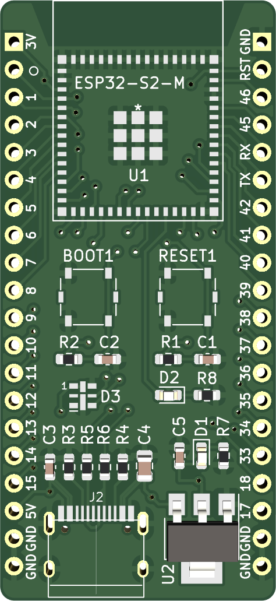
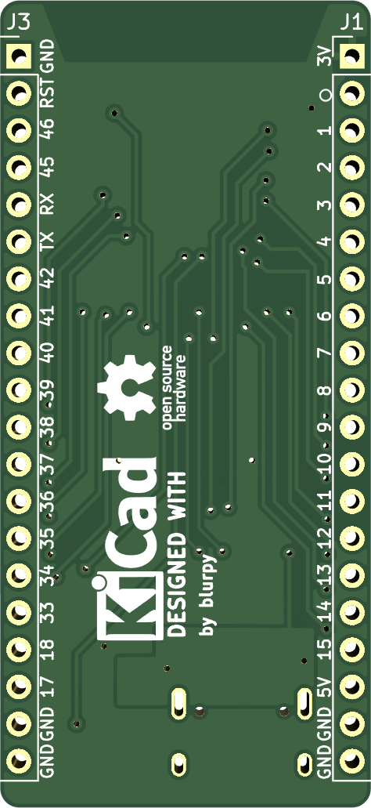
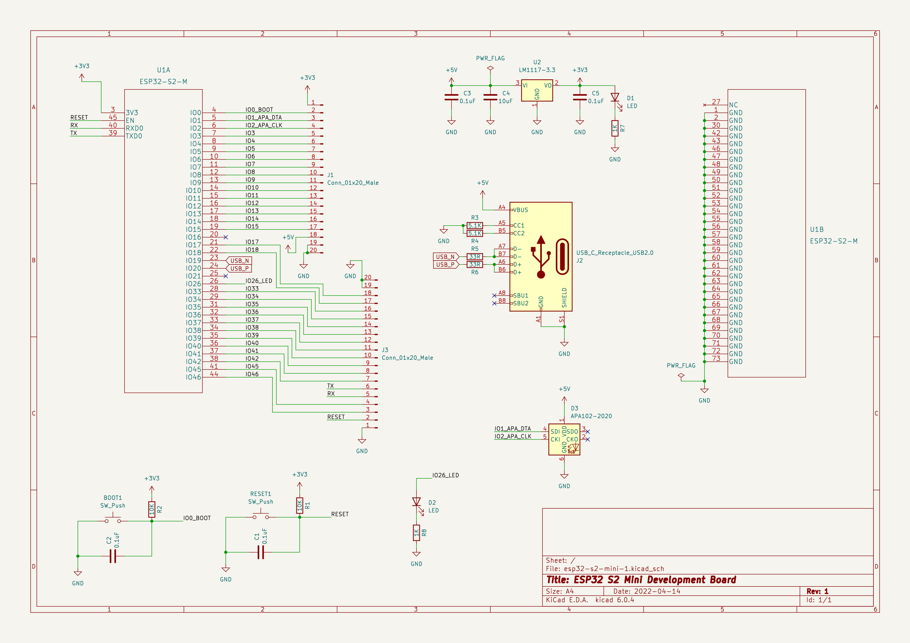

# esp32-pcb-bitraf

ESP32 S2 Mini Development Board PCB created with KiCad 6 at Bitraf workshop, to be ordered from PCBWay.

Reference PCB for the workshop available here: https://github.com/jenschr/ESP32-workshop-files

Inspired by the official development board [ESP32-S2-DevKitM-1](https://docs.espressif.com/projects/esp-idf/en/v4.4/esp32s2/hw-reference/esp32s2/user-guide-devkitm-1-v1.html).

### Features

* Reset switch
* Boot switch for entering programming mode
* Power LED
* General purpose LED
* [DotStar LED](https://learn.adafruit.com/adafruit-dotstar-leds/overview)
* USB-C for power and programming
* Fits on a breadboard

### Board

### Schematic

### Bill of materials

Also available as an [interactive bom](https://blurpy.github.io/esp32-pcb-bitraf/bom/ibom.html).

| Item | Qty | Reference(s)   | Value                   | Type             | Footprint                              | Datasheet                                                                                                     |
|------|-----|----------------|-------------------------|------------------|----------------------------------------|---------------------------------------------------------------------------------------------------------------|
| 1    | 2   | BOOT1, RESET1  | SW_Push                 | Switch           | SW_SPST_Panasonic_EVQPL_3PL_5PL_PT_A08 | ~                                                                                                             |
| 2    | 4   | C1, C2, C3, C5 | 0.1uF                   | Capacitor        | 0603_1608Metric                        | ~                                                                                                             |
| 3    | 1   | C4             | 10uF                    | Capacitor        | 0805_2012Metric                        | ~                                                                                                             |
| 4    | 2   | D1, D2         | LED                     | LED              | 0603_1608Metric                        | ~                                                                                                             |
| 5    | 1   | D3             | APA102-2020             | DotStar LED      | APA102-2020                            | https://www.led-color.com/upload/201604/APA102-2020%20SMD%20LED.pdf                                           |
| 6    | 2   | J1, J3         | Conn_01x20_Male         | Header           | PinHeader_1x20_P2.54mm_Vertical        | ~                                                                                                             |
| 7    | 1   | J2             | USB_C_Receptacle_USB2.0 | USB-C Connector  | TYPE-C-31-M-12                         | https://www.usb.org/sites/default/files/documents/usb_type-c.zip                                              |
| 8    | 2   | R1, R2         | 10K                     | Resistor         | 0603_1608Metric                        | ~                                                                                                             |
| 9    | 2   | R3, R4         | 5.1K                    | Resistor         | 0603_1608Metric                        | ~                                                                                                             |
| 10   | 2   | R5, R6         | 33R                     | Resistor         | 0603_1608Metric                        | ~                                                                                                             |
| 11   | 2   | R7, R8         | 1K                      | Resistor         | 0603_1608Metric                        | ~                                                                                                             |
| 12   | 1   | U1             | ESP32-S2-M              | Microcontroller  | ESP32-S2-MINI-1-N4                     | https://www.espressif.com/sites/default/files/documentation/esp32-s2-mini-1_esp32-s2-mini-1u_datasheet_en.pdf |
| 13   | 1   | U2             | LM1117-3.3              | Linear Regulator | SOT-223                                | https://www.ti.com/lit/ds/symlink/lm1117.pdf                                                                  |

### Libraries

* [USB TYPE-C-31-M-12 from Korean Hroparts Elec @ LCSC](https://github.com/jenschr/USB-C-Connectors)
  *  Available here: https://lcsc.com/product-detail/USB-Connectors_Korean-Hroparts-Elec-TYPE-C-31-M-12_C165948.html
* [Espressif Systems ESP32-S2-MINI-1-N4](https://app.ultralibrarian.com/details/e7064ac7-afcb-11eb-9033-0a34d6323d74/Espressif-Systems/ESP32-S2-MINI-1-N4)
  * Symbol Pin Ordering: Functional
  * Footprint Units: English (mil)
